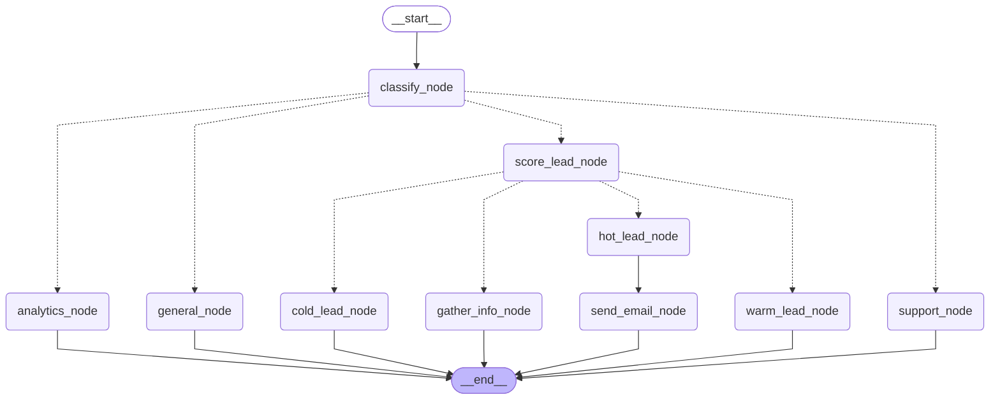

# CRM Workflow Graph Architecture

```mermaid
---
config:
  flowchart:
    curve: linear
---
graph TD;
	__start__([<p>__start__</p>]):::first
	classify_node(classify_node)
	score_lead_node(score_lead_node)
	gather_info_node(gather_info_node)
	hot_lead_node(hot_lead_node)
	warm_lead_node(warm_lead_node)
	cold_lead_node(cold_lead_node)
	send_email_node(send_email_node)
	support_node(support_node)
	analytics_node(analytics_node)
	general_node(general_node)
	__end__([<p>__end__</p>]):::last
	__start__ --> classify_node;
	classify_node -.-> analytics_node;
	classify_node -.-> general_node;
	classify_node -.-> score_lead_node;
	classify_node -.-> support_node;
	hot_lead_node --> send_email_node;
	score_lead_node -.-> cold_lead_node;
	score_lead_node -.-> gather_info_node;
	score_lead_node -.-> hot_lead_node;
	score_lead_node -.-> warm_lead_node;
	analytics_node --> __end__;
	cold_lead_node --> __end__;
	gather_info_node --> __end__;
	general_node --> __end__;
	send_email_node --> __end__;
	support_node --> __end__;
	warm_lead_node --> __end__;
	classDef default fill:#f2f0ff,line-height:1.2
	classDef first fill-opacity:0
	classDef last fill:#bfb6fc

```
