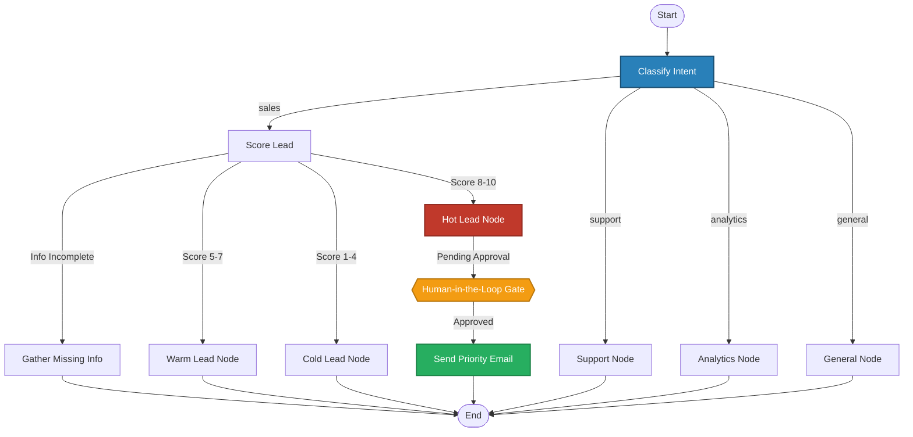

# CRM Workflow Graph Architecture

---

### Workflow Description:
- **Classify Node**: Detects user intent across sales, support, analytics, and general inquiries.
- **Lead Qualifier**: Evaluates lead completeness and computes an intelligent lead score ($1-10$).
- **Multi-Condition Paths**: Routes to **Hot**, **Warm**, **Cold**, or loops back to request missing information.
- **Human-in-the-Loop (HITL)**: Protects high-value actions by pausing before sending priority emails until human confirmation is granted.
