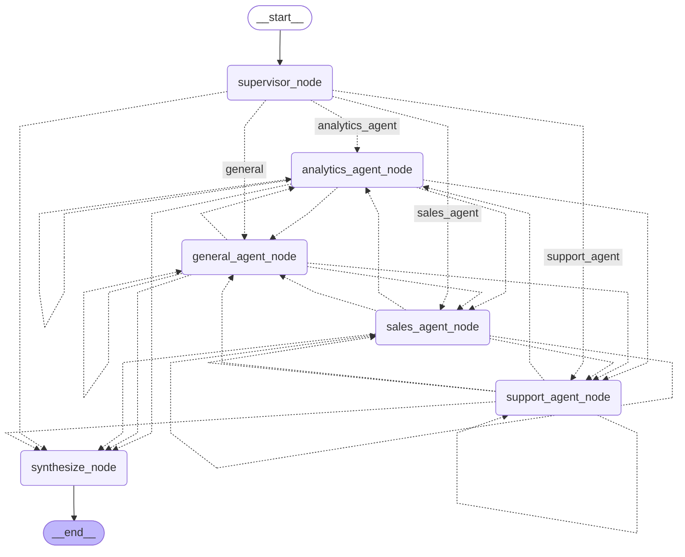

# Multi-Agent Supervisor Architecture

```mermaid
---
config:
  flowchart:
    curve: linear
---
graph TD;
	__start__([<p>__start__</p>]):::first
	supervisor_node(supervisor_node)
	sales_agent_node(sales_agent_node)
	support_agent_node(support_agent_node)
	analytics_agent_node(analytics_agent_node)
	general_agent_node(general_agent_node)
	synthesize_node(synthesize_node)
	__end__([<p>__end__</p>]):::last
	__start__ --> supervisor_node;
	analytics_agent_node -.-> general_agent_node;
	analytics_agent_node -.-> sales_agent_node;
	analytics_agent_node -.-> support_agent_node;
	analytics_agent_node -.-> synthesize_node;
	general_agent_node -.-> analytics_agent_node;
	general_agent_node -.-> sales_agent_node;
	general_agent_node -.-> support_agent_node;
	general_agent_node -.-> synthesize_node;
	sales_agent_node -.-> analytics_agent_node;
	sales_agent_node -.-> general_agent_node;
	sales_agent_node -.-> support_agent_node;
	sales_agent_node -.-> synthesize_node;
	supervisor_node -. &nbsp;analytics_agent&nbsp; .-> analytics_agent_node;
	supervisor_node -. &nbsp;general&nbsp; .-> general_agent_node;
	supervisor_node -. &nbsp;sales_agent&nbsp; .-> sales_agent_node;
	supervisor_node -. &nbsp;support_agent&nbsp; .-> support_agent_node;
	supervisor_node -.-> synthesize_node;
	support_agent_node -.-> analytics_agent_node;
	support_agent_node -.-> general_agent_node;
	support_agent_node -.-> sales_agent_node;
	support_agent_node -.-> synthesize_node;
	synthesize_node --> __end__;
	analytics_agent_node -.-> analytics_agent_node;
	general_agent_node -.-> general_agent_node;
	sales_agent_node -.-> sales_agent_node;
	support_agent_node -.-> support_agent_node;
	classDef default fill:#f2f0ff,line-height:1.2
	classDef first fill-opacity:0
	classDef last fill:#bfb6fc

```
