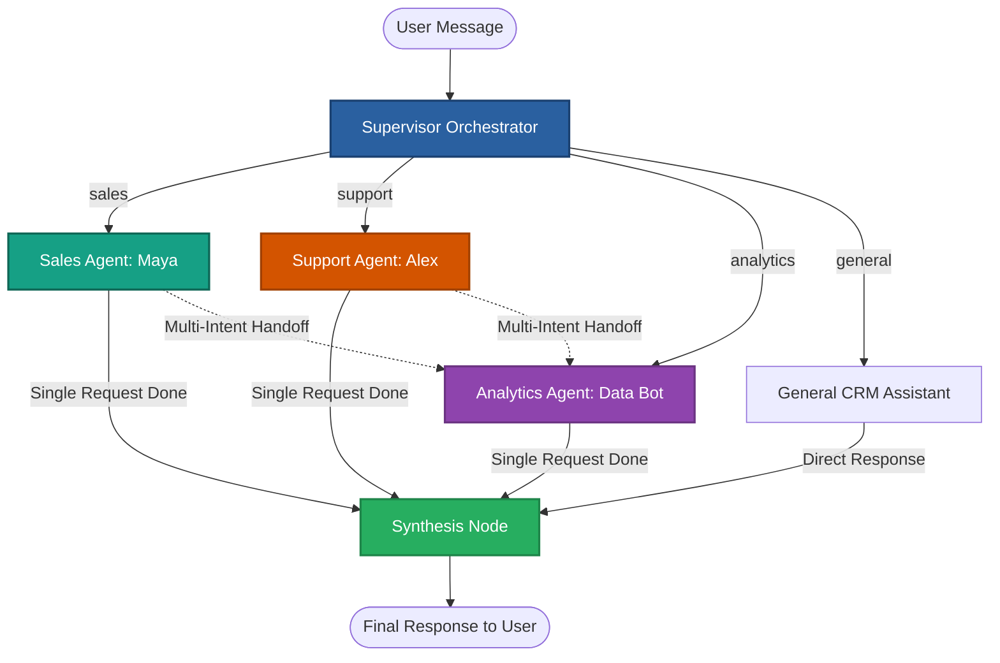

# Multi-Agent Supervisor Architecture

---

### How it works:
1. **User Message**: A user query enters the supervisor system.
2. **Supervisor Orchestrator**: Uses LLM classification to decide which specialist(s) should execute the request.
3. **Specialist Agents**:
   - **Sales Agent (Maya)**: Handles lead qualification, pricing, discounts, and follow-up emails.
   - **Support Agent (Alex)**: Performs RAG vector search across product documentation and refund policies.
   - **Analytics Agent (Data Bot)**: Extracts real-time statistics from the SQLite CRM database.
   - **General Assistant**: Directly handles greetings and general capability inquiries.
4. **Agent Handoff**: For complex multi-intent requests (e.g. *"Add lead AND show pipeline"*), the supervisor passes control sequentially between agents.
5. **Synthesis Node**: Merges individual agent outputs into one unified, cohesive response.
